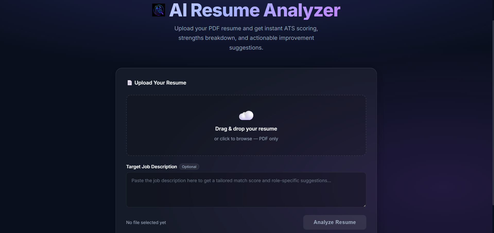
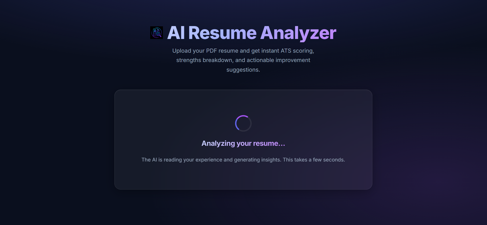
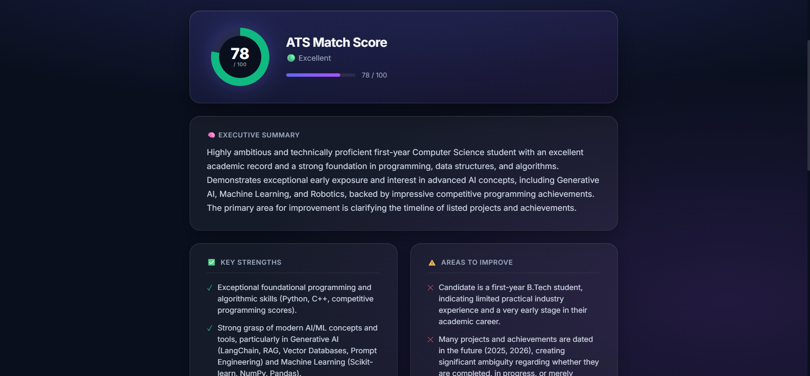

# 🤖 AI Resume Analyzer

An AI-powered ATS (Applicant Tracking System) Resume Analyzer built using React, Node.js, Express, and Google Gemini AI.

Upload your resume, receive an ATS score, identify strengths and weaknesses, extract important keywords, and get personalized recommendations to improve your chances of landing interviews.

---
## Project Link


## 📸 Preview

### Homepage



### Resume Upload



### Analysis Results



---

## ✨ Features

### Resume Analysis

* PDF Resume Upload
* ATS Compatibility Score
* Executive Summary
* Strength Analysis
* Weakness Detection
* Keyword Extraction
* AI-Generated Suggestions

### Job Description Matching

* Compare resume against target job descriptions
* Detect missing skills and keywords
* Improve ATS compatibility

### Modern User Experience

* Drag & Drop Upload
* Responsive Design
* Glassmorphism UI
* Interactive Score Visualization
* Real-Time Feedback

---

## 🛠 Tech Stack

### Frontend

* React
* Vite
* CSS
* JavaScript

### Backend

* Node.js
* Express.js

### AI

* Google Gemini API

### File Processing

* Multer
* PDF-Parse

### Deployment

* Vercel (Frontend)
* Render / Railway (Backend)

---

## 📂 Project Structure
```
AI_RESUME_ANALYSER/
│
├── backend/
├── frontend/
├── screenshots/
├── .gitignore
└── README.md
```

---

## 🚀 Installation

### 1️⃣ Clone the Repository

```bash
git clone https://github.com/YOUR_USERNAME/AI-Resume-Analyzer.git

cd AI-Resume-Analyzer
```

---

## 2️⃣ Setup Frontend

Open Terminal 1

```bash
cd frontend

npm install
```

Start Development Server

```bash
npm run dev
```

Frontend runs at:

```bash
http://localhost:5173
```

---

## 3️⃣ Setup Backend

Open Terminal 2

```bash
cd backend

npm install
```

Create a `.env` file:

```env
GEMINI_API_KEY=YOUR_GEMINI_API_KEY
```

Start Server

```bash
npm start
```

or

```bash
node server.js
```

Backend runs at:

```bash
http://localhost:5000
```

---

## 🔑 Environment Variables

Create:

```bash
backend/.env
```

Add:

```env
GEMINI_API_KEY=YOUR_GEMINI_API_KEY
```

---

## 💻 Usage

1. Launch frontend and backend.
2. Open:

```bash
http://localhost:5173
```

3. Upload a PDF resume.
4. Optionally paste a target job description.
5. Click **Analyze Resume**.
6. Review:

   * ATS Score
   * Executive Summary
   * Strengths
   * Weaknesses
   * Keywords
   * Improvement Suggestions

---


## 🌟 Future Enhancements

* User Authentication
* Resume History
* Resume Version Comparison
* Cover Letter Generator
* Interview Question Generator
* Resume Templates
* Export Analysis Reports
* Admin Dashboard

---


## 👨‍💻 Author

Ansuman Satapathy

GitHub:
https://github.com/Ansuman3010

---


⭐ If you found this project useful, please consider giving it a star.
